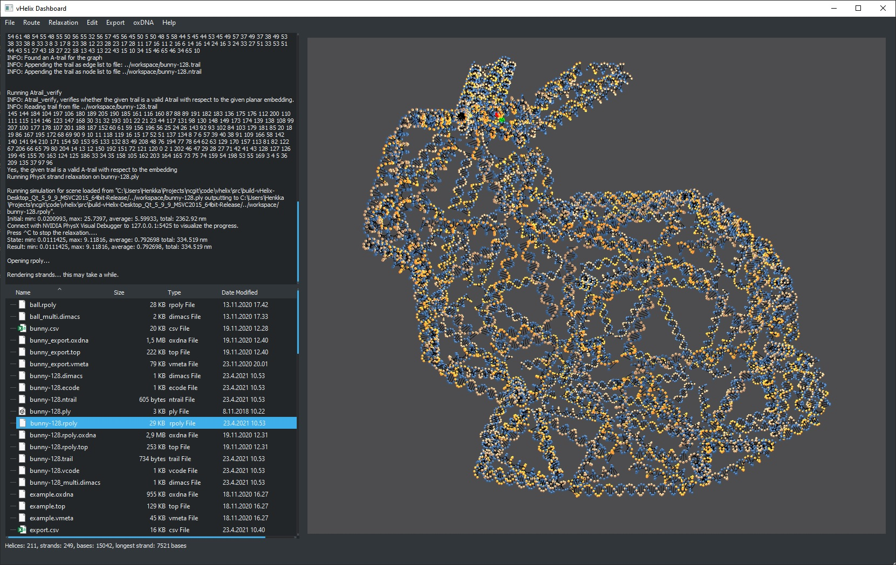

# vHelix Dashboard

This program is a tool for quickly creating DNA origami nanostructures from polyhedral 3D meshes based on the vHelix Autodesk Maya plugin by Björn Högberg and Johan Gardell at the lab of [Björn Högberg](http://www.hogberglab.net/) at Karolinska Insitutet.
Developed by Henrik Granö and Emil Hiitola [Natural computation](https://research.cs.aalto.fi/nc/) at Aalto University.

## Installation

For Linux/MacOS instructions and code, use the `linux-version` branch.

a) Download the prebuilt binaries from http://www.vhelix.net (not yet available), or use the existing Win64 beta provided here.

b) To build the program on your system, you need the following dependencies:

- Qt 5.9.9 available from: https://www.qt.io/download
- Python 3.8 with Python/C API libraries and headers which are probably automatically installed

Included modules and source code:
- [PhysXSDK 3.3](https://github.com/yangzhengxing/PhysX-3.3). PhysXSDK 3.3 is used for physical relaxation DNA structures. It free software as of 2015 and its win64 binaries are included.
- [Lemon Graph library](https://lemon.cs.elte.hu/trac/lemon)
- [Boost C++ libraries](https://www.boost.org/)
- [bscor by Abdulmelik Mohammed (Aalto University)](https://github.com/mohamma1/bscor)
- [tacoxDNA](https://github.com/lorenzo-rovigatti/tacoxDNA),  (A. Suma, E. Poppleton, M. Matthies, P. Šulc, F. Romano, A. A. Louis, J. P. K. Doye, C. Micheletti and L. Rovigatti, ["TacoxDNA: A userfriendly web server for simulations of complex DNA structures, from single strands to origami"](https://doi.org/10.1002/jcc.26029), J. Comput. Chem. 40, 2586 (2019))
- [vHelix](http://www.vhelix.net)
- [objToPly by Nabeel Hussain](https://github.com/nabeel3133/file-converter-.obj-to-.ply)
- [oxDNAviewer](https://github.com/sulcgroup/oxdna-viewer)
- [json by Niels Lohmann](https://github.com/nlohmann/json)
- [BreezeStyleSheets by Alexander Huszagh](https://github.com/Alexhuszagh/BreezeStyleSheets)
- [happly ply parser](https://github.com/nmwsharp/happly)

If you use another platform than Win64 you need to recompile PhysXSDK 3.3 and Lemon for your system. You also need to compile the libraries on your own if you need a debug build.

For convenience, it is recommended to use Qt Creator for building: https://www.qt.io/download. If you use other tools, note that the directory structure may be slightly different: Qt Creator places the binary in a separate build folder beside src/.

The software is built using CMake to make cross-platform compilation possible. Configure the CMakeLists.txt file to find the specified Qt modules as well as Python.h and Python38.lib files for the Python/C API. To build, run the CMakeLists.txt file with CMake or open it in Qt Creator.

*Note!:* In runtime, all the Python files (as seen in one of the provided src/builds build-vHelix-Desktop_Qt_5_9_9_MSVC2015_64bit-Release for reference) and PhysX .dlls should be beside the vHelix Dashboard executable. The .dlls should also be in src/vHelix/scaffold_routing_rectification directory. 
Qt Creator only copies the necessary Qt .dlls beside the executable, you need to copy the PhysX .dlls and Python scripts to your build directory yourself. Additionally, the files settings.json, instructions.txt and license.txt should also be beside the built executable. If the program compiles but crashes immediately you are probably missing a .dll from your build directory - if you do not see
 a clear error message, see the provided build directory for reference on what should be copied.

## Quick start

Workflow/pipeline for generating a sequence and model from a .ply or .obj model:

- Run the executable DNAforge.exe
- Import a .ply or .obj file from File->Import
- Click on the .ply/.obj file you imported in the workspace window (lower left pane) to select it, select a design method from the Design menu. Adjust the options in the dialog that pops up. Run the design algorithm by clicking Ok.
- Keep an eye on the console (upper left) panel, it tells you about the progress and if something goes wrong. If everything goes Ok, you should see a .oxview file appear in the workspace
- If you want to view the model in oxDNA format, there is a shortcut to a local oxDNAviewer from oxDNA->Open oxDNA viewer. You can drag and drop .conf and .top files or an .oxview file directly in the oxDNAviewer window to load them. However, it is recommended to use the most recent version online instead: https://github.com/sulcgroup/oxdna-viewer
- Once the 3D model appears on the right (3D performance not yet optimized), you can do export the strands as a csv file from Export->Export strand sequences.
- You can rotate the model using the right mouse button and translate the camera using the left mouse button. Use shift+arrow keys or the scroll wheel for zooming.
- It's a good idea to a) check that all strands are long enough and b) they are connected properly and in the right way, you can easily do this in oxView
- You can adjust settings from Help->Settings

## Todo

- Proper documentation
- Remove unused code
- Relaxation that works in Linux & Mac
- Spanning tree routing
- Qt3D performance improvements
- BUG: Autofill strand gaps with simulated annealing sequence generation in scaffold-free design
- Quality indicator for the simulated annealing sequence generator
- Physical relaxation optimizer timeout to settings