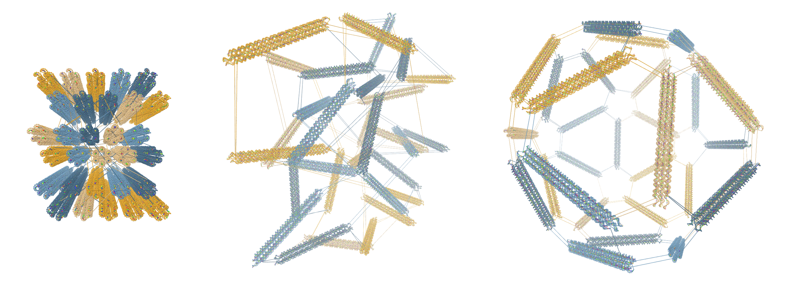

# Examples
Included in this directory is a set of example structures and tutorials to help you get started. Structures used in our [paper](https://doi.org/10.1101/2020.01.24.917419 "paper") are also included to help you reproduce them.

## Analysis examples from the paper
Examples reproducing the analysis figures of our paper can be found in the [`oxdna_analysis_tools`](https://github.com/sulcgroup/oxdna_analysis_tools/tree/master/paper_examples) repository. The structures are as follows:
 * [Holliday junction](https://sulcgroup.github.io/oxdna-viewer/?configuration=https%3A%2F%2Fraw.githubusercontent.com%2Fsulcgroup%2Foxdna_analysis_tools%2Fmaster%2Fpaper_examples%2FPCA%2Fholliday.dat&topology=https%3A%2F%2Fraw.githubusercontent.com%2Fsulcgroup%2Foxdna_analysis_tools%2Fmaster%2Fpaper_examples%2FPCA%2Fholliday.top)
* [Design 20](https://sulcgroup.github.io/oxdna-viewer/?configuration=https%3A%2F%2Fraw.githubusercontent.com%2Fsulcgroup%2Foxdna_analysis_tools%2Fmaster%2Fpaper_examples%2Fangles%2F20.dat&topology=https%3A%2F%2Fraw.githubusercontent.com%2Fsulcgroup%2Foxdna_analysis_tools%2Fmaster%2Fpaper_examples%2Fangles%2F20.top)
 * [Design 23](https://sulcgroup.github.io/oxdna-viewer/?configuration=https%3A%2F%2Fraw.githubusercontent.com%2Fsulcgroup%2Foxdna_analysis_tools%2Fmaster%2Fpaper_examples%2Fangles%2F23.dat&topology=https%3A%2F%2Fraw.githubusercontent.com%2Fsulcgroup%2Foxdna_analysis_tools%2Fmaster%2Fpaper_examples%2Fangles%2F23.top).
 * [RNA tile trajectory](https://sulcgroup.github.io/oxdna-viewer/?configuration=https%3A%2F%2Fraw.githubusercontent.com%2Fsulcgroup%2Foxdna_analysis_tools%2Fmaster%2Fpaper_examples%2Fclustering%2Ftrajectory.dat&topology=https%3A%2F%2Fraw.githubusercontent.com%2Fsulcgroup%2Foxdna_analysis_tools%2Fmaster%2Fpaper_examples%2Fclustering%2Frna_tile.top)
 * [TMF open](https://sulcgroup.github.io/oxdna-viewer/?configuration=https%3A%2F%2Fraw.githubusercontent.com%2Fsulcgroup%2Foxdna_analysis_tools%2Fmaster%2Fpaper_examples%2Fdistances%2Ftmf_open.dat&topology=https%3A%2F%2Fraw.githubusercontent.com%2Fsulcgroup%2Foxdna_analysis_tools%2Fmaster%2Fpaper_examples%2Fdistances%2Ftmf.top)
 * [TMF closed](https://sulcgroup.github.io/oxdna-viewer/?configuration=https%3A%2F%2Fraw.githubusercontent.com%2Fsulcgroup%2Foxdna_analysis_tools%2Fmaster%2Fpaper_examples%2Fdistances%2Ftmf_closed.dat&topology=https%3A%2F%2Fraw.githubusercontent.com%2Fsulcgroup%2Foxdna_analysis_tools%2Fmaster%2Fpaper_examples%2Fdistances%2Ftmf.top)
 * [H-bonds RNA Tile](https://sulcgroup.github.io/oxdna-viewer/?configuration=https%3A%2F%2Fraw.githubusercontent.com%2Fsulcgroup%2Foxdna_analysis_tools%2Fmaster%2Fpaper_examples%2Fh_bonds%2Frna_tile.dat&topology=https%3A%2F%2Fraw.githubusercontent.com%2Fsulcgroup%2Foxdna_analysis_tools%2Fmaster%2Fpaper_examples%2Fh_bonds%2Frna_tile.top)
 * [RNA rectangle](https://sulcgroup.github.io/oxdna-viewer/?configuration=https%3A%2F%2Fraw.githubusercontent.com%2Fsulcgroup%2Foxdna_analysis_tools%2Fmaster%2Fpaper_examples%2Fmds_mean%2Frna_rectangle.dat&topology=https%3A%2F%2Fraw.githubusercontent.com%2Fsulcgroup%2Foxdna_analysis_tools%2Fmaster%2Fpaper_examples%2Fmds_mean%2Frna_rectangle.top)

## Rigid-body relaxation

As described [earlier](https://github.com/sulcgroup/oxdna-viewer#rigid-body-simulations "main README"),  caDNAno files exported to oxDNA using conversion tools will be planar and near impossible to relax using the usual relaxation methods in oxDNA. The following examples showcases our rigid-body simulator that attempts to automatically rearrange these flat CaDNAno designs to a configuration that can be relaxed using traditional molecular dynamics methods.

**[1. Rigid-body triangle](https://github.com/sulcgroup/oxdna-viewer/tree/master/examples/triangle)**
This is a minimal example of a triangle (well, technically a circle) drawn as three parallel helices in caDNAno. Clustering and applying rigid-body dynamics rearanges the helices into a triangular shape.

**[2. Rigid-body square](https://github.com/sulcgroup/oxdna-viewer/tree/master/examples/square)**
This is a larger example where a connected set of four 6-helix bundles are converted from caDNAno, clustered and then automatically relaxed into a square.
